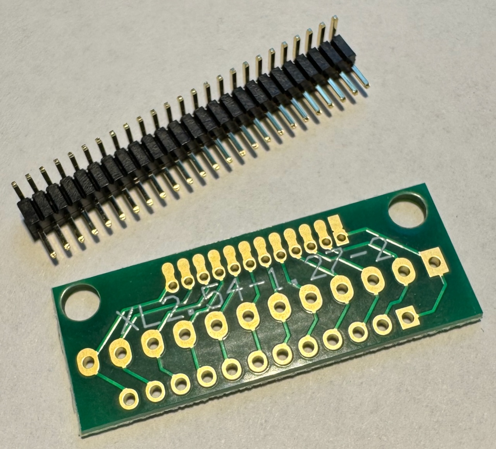
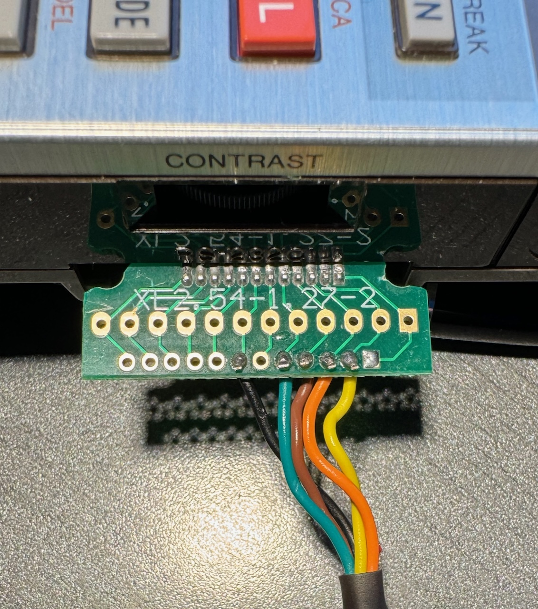
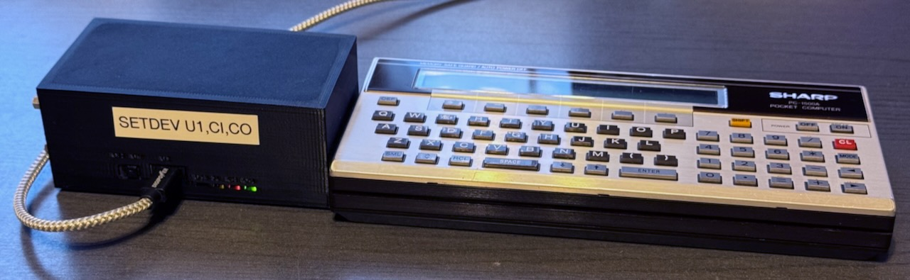

# Hardware for communication

## PC-1600: USB Serial Adapter

The Sharp PC-1600 has a serial device built in. It uses fairly standard 5V logic, and can be interfaced
with currently available FTDI adapters. When using an original (non-cloned) FTDI adapter, no additional
logic chips or inverters are required.

These are the components that I used:

- 1mm pins, bent 90 degrees
- A small board for soldering the pins. Search for "1.27mm 2.54mm Adapter Board" on the merchant site of your choice.
  While I found no 15 pin boards, 12 pins are enough for the signals that are required.
- USB/UART cable, I used this one: "FTDI TTL-232R-5V-WE", i.e. 5V logic and wire ends.

Before the USB / UART adapter can be used, it needs to be reprogrammed using a Windows
machine. The signals of the RX, TX, RTS and CTS pins need to be inverted. This
can be done with a utility provided by FTDI, and is not covered here.
This is a one time operation, because the change is persistent even after
unplugging the cable.

The wiring is as follows (pin 1 is the rightmost pin of the PC-1600's 15-pin serial connector):

| Pin | Signal PC-1600 | Connect this cable of the USB/UART | USB/UART wire color |
|-----|----------------|------------------------------------|---------------------|
| 2   | TX             | RX                                 | yellow              |
| 3   | RX             | TX                                 | orange              |
| 4   | RTS            | CTS                                | brown               |
| 5   | CTS            | RTS                                | green               |
| 7   | Ground         | Ground                             | black               |

Note: Do not connect the red cable (5V) of the adapter. I simply cut the cable off.

Note that I had to trim the edges of the board, because it would not have fit otherwise:

## PC-1500/A: CE-158X

The PC-1500 does not have a serial port built in. There was an add-on from Sharp
called "CE-158" which provided a serial and a parallel port. `sde` is not currently
compatible with the original device, but it would not be difficult to change this.

[Jeff Birt](https://github.com/Jeff-Birt) built a modern equivalent of this add-on,
and sells it under the name
[CE-158X](https://www.soigeneris.com/ce-158x-serial-parallel-interface-for-sharp-pc-1500).
`sde` is tested with the USB port (U1) of the CE-158X.